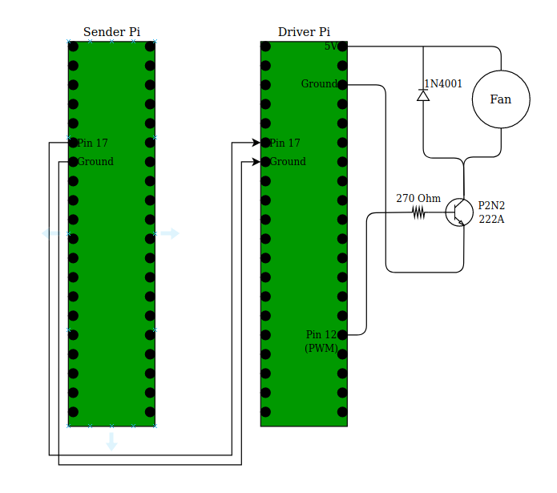

A simple program to control a fan for a Raspberry Pi Cluster.

"sudo make driver" creates and sets up all the files to control the fan, and to recieve temperature readings from another pi. 
It also starts the driver file as a background process.

"sudo make sender" sets up all the files send temperature to another pi. It also starts the sender file as a backgroung
process

Wiring Diagram: 

